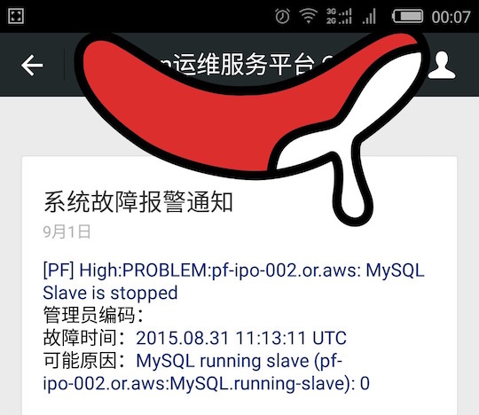

#通过微信服务号推送ZABBIX告警


近期看到一篇通过微信订阅号实现Zabbix告警的文章，但实践后发现有几个问题。

```
1. 需要订阅者主动向订阅号发送一条消息后，订阅号才能在后续48小时内向订阅者推送消息

2. 消息放松频繁的情况下，会需要经过图形验证码处理后才能继续发送消息

```

本文经我自己验证，是可以实现通过微信推送消息的。这种实现基于微信服务号平台的“模板短信”功能，必要条件如下：

```

微信服务号通过微信认证（需提交公司营业执照等等信息，同时会收取300元/年的认证服务费用）。
```

这个实现方法，还需要Python + Shell脚本的配合，我已经放到github上了，在如下的实施步骤中也有说明。

备注：如果个人用户的话，建议可以直接使用QQ邮件+微信邮件提醒。

好叻，下面开始我们整个步骤。
## 一、注册微信服务号，并进行微信认证

关于微信服务号的注册及认证，请看微信官方指引

## 二、开通模板消息功能以及报警通知模板

1. 在微信公众平台管理后台添加功能-模板消息
2. 从模板库中选择报警通知模板（后面以“IT/网络游戏”的“系统故障告警通知”模板进行配置，其他行业内的告警类模板可能会有不同，可参照配置）

### 三、下载配置告警通知脚本

```
# 下载告警通知脚本
$ git clone https://github.com/vincihu/misc/
# 部署告警通知脚本到zabbix的alertscripts目录
$ sudo mv misc/AlertWeixin /usr/lib/zabbix/alertscripts/
$ sudo ln -s /usr/lib/zabbix/alertscripts/{AlertWeixin/AlertWeixin.sh,}
$ sudo mkdir /usr/lib/zabbix/alertscripts/logs
# 为脚本添加zabbix用户执行权限
$ sudo chmod u+x AlertWeixin.sh
$ sudo chown zabbix:zabbix /usr/lib/zabbix/alertscripts/{logs/,AlertWeixin.sh}
# 安装需要的python模块
$ sudo pip install -U configparser requests simplejson
```
修改AlertWeixin/AlertWeixin.conf，填入微信服务号相关信息

```
[default]
appid       = {appid}
secret      = {secret}
template_id = {template_id​}
```

## 四、获取微信服务号订阅用户信息

```
# 使用wxGetUserInfo.py脚本获取服务器订阅用户列表，以及其openid
# openid用于后续的告警接收，相当于邮件告警的邮件地址
$ cd /usr/lib/zabbix/alertscripts/AlertWeixin/
$ python wxUserInfo.py  2>/dev/null
nickname:  JasonQu
openid:  AAAA
headimgurl:  http://wx.qlogo.cn/mmopen/XXXX/0
nickname:  胡文西
openid:  BBBB
headimgurl:  http://wx.qlogo.cn/mmopen/YYYY/0
```

## 五、配置Zabbix

1. 添加Media type(告警媒介)

	```
Name:               X. AlertWeixin
Type:                 Script
Script name:     AlertWeixin.sh
```

2. 配置profile - Media(告警接收ID)

	```
Type:                X. AlertWeixin
Send to:            {openid}
```

## 六、测试验证

测试告警，微信消息截图如图



---
## 其他
- 以公司为微信公众号使用主体，建议使用微信企业号
	- 可以对关注人进行身份验证，避免无关人员使用公司内部服务
	- 用户账号配置不需要获取openid，可以自行为用户命名（如姓名拼音），并作为通知接收人
	- 企业号支持多种格式消息推送，还可以通过消息回调接入其他内部运维自动化服务
- 想让Zabbix告警使用语音电话通知，请看[AlertCall](https://github.com/vincihu/misc/tree/master/AlertCall)

